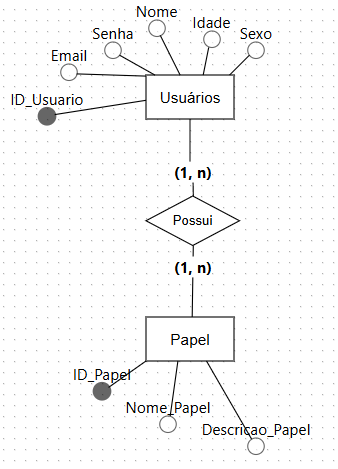
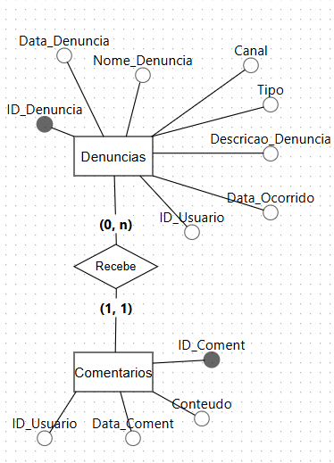

# Eco Denúncia

Projeto desenvolvido para as disciplinas **Sistemas Distribuídos** e **Mobile & Usabilidade** com foco em desenvolvimento web, mobile e jogos.

**Empresa parceira:** Banco Bradesco

## Grupo

- Rafael Rossetto Guitarrari (RA: 823158602)
- Fabrício de Barros Narbon (RA: 822227166)
- Bianca Alves Ribeiro (RA: 8222240261)
- Luiz Gustavo França de Abreu (RA: 823210075)
- Gabrielle Garcia Paz (RA: 823126085)
- Webster Diógenes Rodrigues (RA: 8222242764)

---

## Banco de Dados — visão geral

Este projeto usa duas bases SQLite separadas, cada uma responsabilizando-se por um contexto distinto (padrão microserviços). Separar os bancos facilita isolamento de responsabilidade e escalonamento independente.



Descrição: dados de usuários e autenticação/autorização.



Descrição: dados de denúncias e comentários.

### Scripts DDL (SQLite)

1) Banco `usuarios.db` (autenticação / autorização)

```sql
CREATE TABLE IF NOT EXISTS Usuarios (
    ID_Usuario INTEGER PRIMARY KEY AUTOINCREMENT,
    Nome VARCHAR(100) NOT NULL,
    Email VARCHAR(255) NOT NULL UNIQUE,
    Senha VARCHAR(255) NOT NULL,
    Idade INT,
    Sexo VARCHAR(10)
);
```

2) Banco `denuncias_coments.db` (denúncias e comentários)

```sql
CREATE TABLE IF NOT EXISTS Denuncias (
    ID_Denuncia INTEGER PRIMARY KEY AUTOINCREMENT,
    Nome_Denuncia VARCHAR(150),
    Canal VARCHAR(50),
    Tipo VARCHAR(50),
    Descricao_Denuncia TEXT,
    Data_Ocorrido DATETIME,
    Data_Denuncia DATETIME NOT NULL DEFAULT CURRENT_TIMESTAMP,
    ID_Usuario INTEGER NOT NULL
);

CREATE TABLE IF  NOT EXISTS Comentarios (
    ID_Coment INTEGER PRIMARY KEY AUTOINCREMENT,
    Conteudo TEXT NOT NULL,
    Data_Coment DATETIME NOT NULL DEFAULT CURRENT_TIMESTAMP,
    ID_Usuario INTEGER NOT NULL,
    ID_Denuncia INTEGER NOT NULL, 
    FOREIGN KEY (ID_Denuncia) REFERENCES Denuncias (ID_Denuncia) ON DELETE CASCADE
);
```

### Explicação dos relacionamentos e integridade

- A tabela `Comentarios` referencia `Denuncias` por `ID_Denuncia`. Definimos `ON DELETE CASCADE` para que, se uma denúncia for removida, seus comentários associados também sejam removidos automaticamente — isso mantém integridade referencial sem sobras.
- Não há chave estrangeira declarando `ID_Usuario` como FK nesta documentação (poderia haver), pois os usuários vivem em outro banco (`usuarios.db`).

Alternativa visual: use o DB Browser for SQLite (gratuito) para inspecionar e editar os arquivos `.db` com GUI.

### Exemplos de consultas comuns

```sql
-- listar denúncias de um usuário
SELECT * FROM Denuncias WHERE ID_Usuario = ? ORDER BY Data_Denuncia DESC;

-- obter comentários de uma denúncia
SELECT * FROM Comentarios WHERE ID_Denuncia = ? ORDER BY Data_Coment ASC;
```
