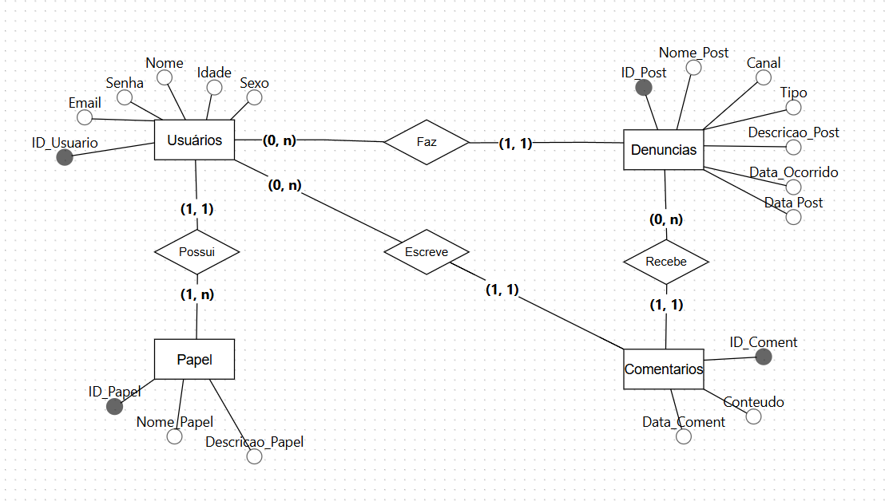

# Eco Denúncia

Este projeto foi desenvolvido para as Unidades Curriculares de **Sistemas Distribuídos** e **Mobile & Usabilidade**, com foco em desenvolvimento web, mobile e jogos.

**Empresa parceira:** Banco Bradesco

---

## Modelagem do Banco de Dados

Abaixo está o diagrama MER (Modelo Entidade-Relacionamento) utilizado para a modelagem do banco de dados do sistema:

> **Nota:** O diagrama acima representa as entidades, seus atributos e os relacionamentos entre elas, conforme as necessidades do sistema.

